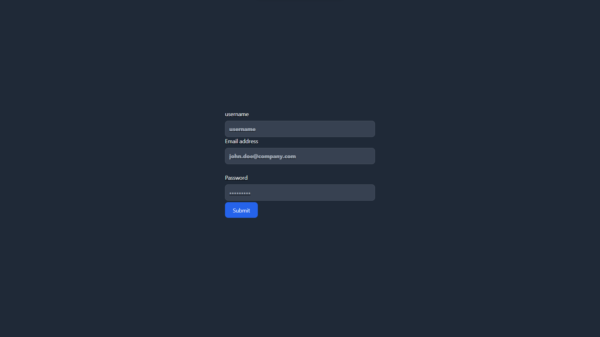
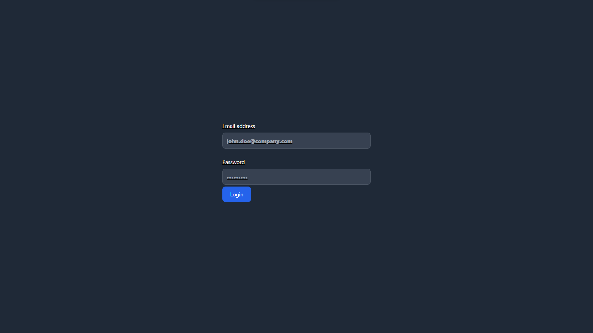
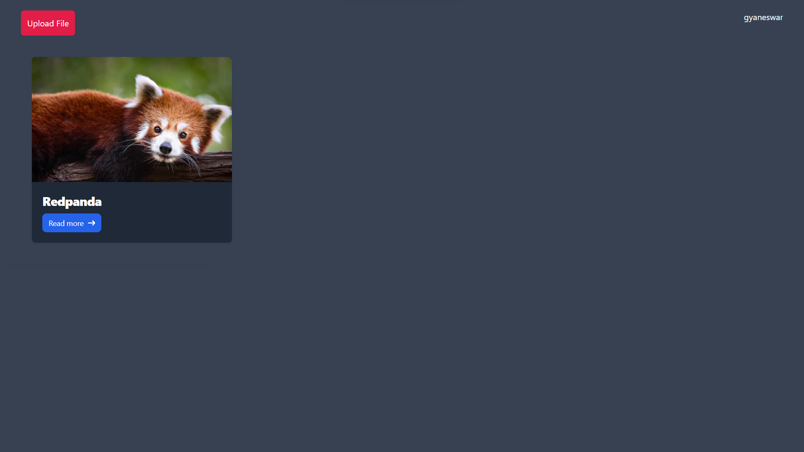

#  Cloud Storage🌫️

This project is a cloud-based file storage website where users can log in, upload their images, and store them in the cloud. It is built using **Express**, **Mongoose**, and **EJS**.

## Features
- **User Authentication**: Users can create an account and log in to the website.
- **Image Upload**: Users can upload their images and store them securely.
- **Cloud Storage**: Uploaded images are stored in the cloud.

## Tech Stack
- **Backend**: Express.js
- **Database**: MongoDB with Mongoose
- **Template Engine**: EJS
- **Cloud Storage**: Cloudinary
## Prerequisites
Before you begin, ensure that you have the following installed:
- **Node.js**: Download and install from [here](https://nodejs.org/).
- **MongoDB**: You can set up a local instance or use a cloud version like MongoDB Atlas.

## Installation

1. Clone the repository to your local machine:
   ```bash
   git clone https://github.com/Gyaneswar-1/cloud-drive.git
   ```

2. Navigate to the project directory:
   ```bash
   cd drive-website
   ```

3. Install the required dependencies:
   ```bash
   npm install
   ```
4. Set up environment variables (You may want to add a `.env` file for storing sensitive data such as your cloud storage credentials):
   `env`
   `MONGO_URI=`
   `JWT_SECRET=`

   # cloudinary 
   `CLOUDINARY_API_SECRET=`
   `CLOUDINARY_API_KEY=`
   `CLOUDINARY_CLOUD_NAME=`
   

5. Start the application:
   ```bash
   npm start
   ```

6. Open your browser and go to:
   ```
   http://localhost:3000/user/register
   ```

## Usage

1. **Create an Account**: If you’re a new user, sign up by providing your username, email, and password.
2. **Log in**: Use your credentials to log in to the website.
3. **Upload Images**: After logging in, you’ll be able to upload your images.
4. **View Uploaded Images**: Once uploaded, you can view your images stored in the cloud.

## Screenshots

Below are some screenshots of the website interface:
### Register Page


### Login Page


### Upload Page/home page



## Running Tests

To run tests for the project, use the following command:
```bash
npm test
```

## Troubleshooting

- If you encounter errors related to MongoDB or cloud storage, ensure that your environment variables are correctly configured.
- Check that your cloud storage service credentials  are valid.


---

Feel free to contribute to the project or suggest improvements by submitting issues or pull requests!
